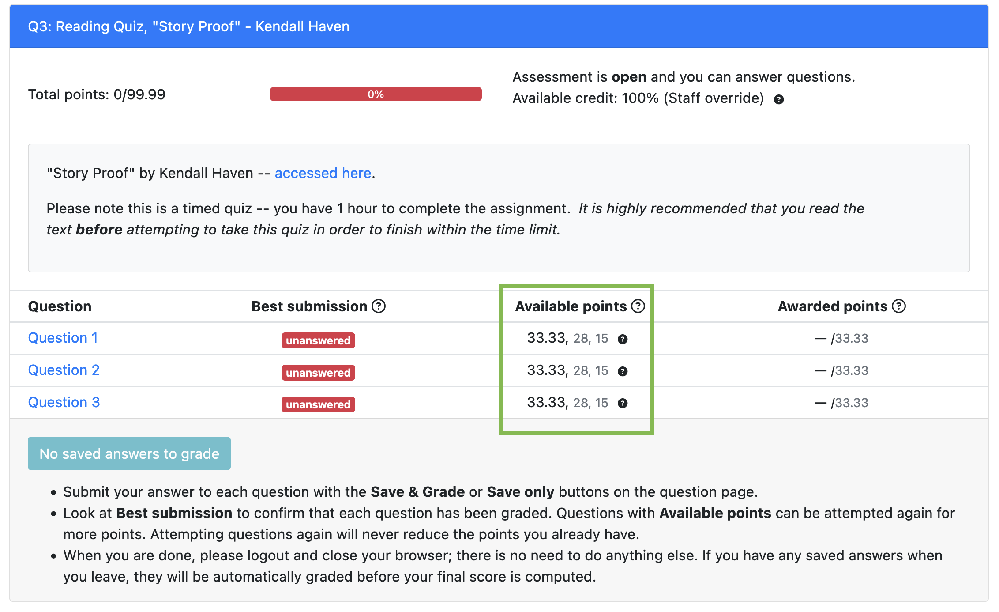
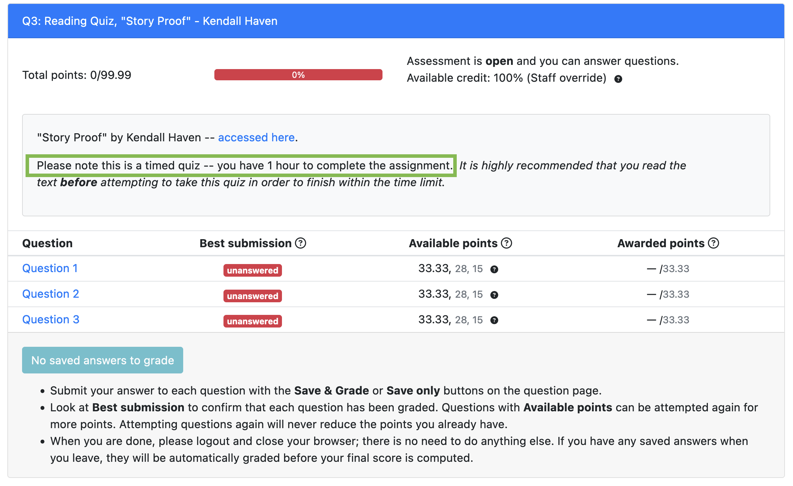
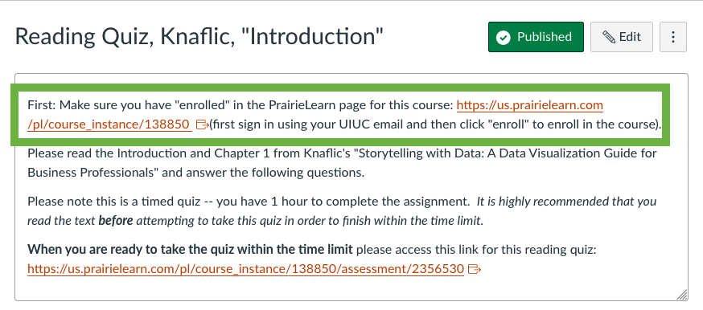

 
 
 

# A few notes about quizzes

notes:
just a few more details about reading quizzes since we have some due dates for those coming up

---

## Note 1 - You (typically) get 3 tries per question

(This might be updated for True/False questions)

notes:
right now its ~100%, 84%, 50% for each choice but we might update this for T/F questions since there are only true choices 

same with multi-check boxes, we might update this to give you more tries, but we might just leave as it to keep it simple.  

Stay tuned!

---

## Note 2 - Timed!

Each quiz has a *1 hour* time limit.

notes:
make sure you don't click on the link on Canvas until you are ready to take the quiz!

---

## Note 2 - Timed!

notes:
The link will be on Canvas like so with big bold letters telling you not to click until you are ready.

---

## Note 2 - Timed!

Full assessment list on PrairieLearn: https://us.prairielearn.com/pl/course_instance/187558

notes:
If you want to see the full list of assessments, you can always click on the main PL course link at the top of the first few quizzes OR on the main "home page" of canvas.

**stop for questions**

---

## To storytelling with Prof. Comstock!
