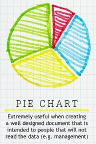
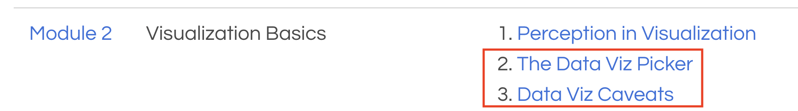

       

# Designing a Good Viz

notes:

How do we design a good viz?  Will go through some "best practices", but be warned it will also take a bit of practice.

How to make a good viz:
1. Part 1: choosing your viz
  * mini perception channels
  * data -- viz, types of viz
  * include "types of viz image"
  * look at types of viz webpage

2. Part 2: designing your viz
  * some of tufte
  * go through caveats webpage

---

   
# Designing a Good Viz: Part 1
## Perception Channels & Types of Plots

notes:
first, let's understand how humans actually translate different kinds of visuals into knowledge about the data being presented and how that relates to different kinds of plots or charts

---

## Perception Channels

<table>
<tr>
<td> Closure</td>
<td> Color</td>
<td> Size</td>
<td> Density</td>
<td> Curvature</td>
</tr>
<tr>
<td> Intensity</td>
<td> Orientation</td>
<td> Depth Cues</td>
<td> Intersection</td>
<td> Terminators</td>
</tr>
</table>

Check out [csc2.ncsu.edu/faculty/healey/PP](https://www.csc2.ncsu.edu/faculty/healey/PP) for more examples and research.

notes:

so in my data viz class we take a week or 2 to cover this so we'll only do a brief overview, but at a very basic level -- there are different kinds of "channels" through which humans can perceive representations of data

some of these channels are more/less effective at conveying information -- which of these "pop out" the most to you?

---

## Preattentive Processing

Which image has the red dot?

  

 

Check out [csc2.ncsu.edu/faculty/healey/PP](https://www.csc2.ncsu.edu/faculty/healey/PP) for more examples and research.

notes:
there are several very powerful perception channels like color which is a "preattentive attribute" -- this means that our brain can sense changes in color before we have to actively focus on an image

this is why you probably immediately saw which of these images had a red dot in it

---

## Strength of Perception Channels

notes:
different perception channels map more or less "truthfully" to data -- a fun example is shown here

for example we can see that there is about a 1-to-1 correspondence between the physical length of an object and our perceived length of the object

while for something like area our perception is much less sensitive

this is why something like a bar chart is typically a better way to communicate with data than a pie chart

also, don't try to visualize data with electric shocks please! :D

---

## Perception Channels to Data Encodings

notes:
we can map the effectiveness of different perception channels roughly to the kinds of marks we want to make for different kinds of data

for example, for ordered data like quantitative or ordered categorical something like position on a common scale (i.e. a bar chart) is at the top, 

while something like volume (i.e. a 3D chart) is on the bottom

---

## What kinds of plots should we use with what kinds of data?

notes:
so, the natural next question would probably be, what kinds of precise plots should we use with a particular kind of data?  like a set of time varying points or a bunch of categorical variables?

---

## What kinds of plots should we use with what kinds of data?

notes:
the short answer, is it depends but you'll definitely find suggestions from various folks out there

for example, this is a pretty silly chart...

---

## What kinds of plots should we use with what kinds of data?

Caption: Extremely useful when creating a well designed document that is intended to people that will not read the data (e.g. management)

notes:
for example, it suggests that pie charts are good for management since that is a chart they are used to seeing...

---

## What kinds of plots should we use with what kinds of data?

Caption: Chart used by responsible analysts who understand the power of segmentation and the sadness that comes from aggregating data.

notes:
and suggests something like a histogram/barchart is for use by very serious analysts :D

---

## What kinds of plots should we use with what kinds of data?

Under "Syllabus" or "Module 2" on Course webpage.

notes:
while you can find such snarky advise all over the internet, it might be useful for us to have a somewhat structured way to figure out what kind of plot to consider playing with with what kind of data

some resources for this are under the "PowerBI Resources" Module on Canvas...

---

<embed src="https://www.data-to-viz.com/#spider" style="width:100%; height:80vh">

notes:
the first one is the "Visualization Picker"

hit "Explore" to see some suggestions for what kinds of visualizations we should use with what kinds of data

**go through the 1 column of numerical data**

**then have students select numeric, categorical, etc and then select other options**

note -- some of them are hard to read, but you can hover over many of them for examples

---

## Translating Data-to-Viz pages

To translate main page use [Google Translate for Webpages](https://translate.google.com/?sl=auto&tl=en&op=websites) for the direct url: [https://www.data-to-viz.com/#spider](https://www.data-to-viz.com/#spider)

---

## Translating Data-to-Viz pages

To translate main page use [Google Translate for Webpages](https://translate.google.com/?sl=auto&tl=en&op=websites) for the direct url: [https://www.data-to-viz.com/#spider](https://www.data-to-viz.com/#spider)

"Hover-overs" won't work, so, keeping the original, untranslated site open pick a specific plot:

---

## Translating Data-to-Viz pages

To translate main page use [Google Translate for Webpages](https://translate.google.com/?sl=auto&tl=en&op=websites) for the direct url: [https://www.data-to-viz.com/#spider](https://www.data-to-viz.com/#spider)

"Hover-overs" won't work, so, keeping the original, untranslated site open pick a specific plot:

Then click on the last "dedicated page" link at the bottom and pass that URL to google translate, for example [https://www.data-to-viz.com/graph/histogram.html](https://www.data-to-viz.com/graph/histogram.html).

notes:
**actually go through these!**

---

   
# Designing a Good Viz: Part 2
## How do we avoid misleading folks?

notes:

let's say we've figured out what visual representation we want to use -- so, we've chosen the right plot for our data

how do we avoid misleading folks?

---

## Tufte's 6 Principles for Graphical Excellence

1. **Comparisons:**  Show data by comparisons (bar charts and the like) to depict contrasts and differences between dependent variables.

2. **Causality:**  Demonstrate how one or more independent variables impact or influence dependent variables.

3. **Multivariate:** Various data are combined so an audience can easily interpret an otherwise complex narrative.

4. **Integration:**  Incorporate various modes of information (texts, maps, calculations, diagrams, etc.), to show evidence of source data-to-findings. 

5. **Documentation:**  For credibility, include attribution, detailed titles, and measurements (scales).

6. **Context:** Describe or depict the before and after state. Show trend lines to hint at results in the future.

Excerpt from [ISDI](https://internationalservicedesigninstitute.com/tuftes-6-principles-graphical-integrity-adopted-service-design/).

notes:
so someone you should probably know about is Edward Tufte who's pretty famous in design

while we won't have time to go through all of these principles in detail today (you'll get them in reading Knaflic over the next couple of weeks)... 

---

## Tufte's 6 Principles for Graphical Excellence

1. **Comparisons:**  Show data by comparisons (bar charts and the like) to depict contrasts and differences between dependent variables.

2. **Causality:**  Demonstrate how one or more independent variables impact or influence dependent variables.

3. **Multivariate:** Various data are combined so an audience can easily interpret an otherwise complex narrative.

4. **Integration:**  Incorporate various modes of information (texts, maps, calculations, diagrams, etc.), to show evidence of source data-to-findings. 

5. **Documentation:**  For credibility, include attribution, detailed titles, and measurements (scales).

6. **Context:** Describe or depict the before and after state. Show trend lines to hint at results in the future.

Excerpt from [ISDI](https://internationalservicedesigninstitute.com/tuftes-6-principles-graphical-integrity-adopted-service-design/).

notes:
let's do a quick overview

---

## Tufte's 6 Principles for Graphical Excellence

1. **Comparisons:**  Show data by comparisons (bar charts and the like) to depict contrasts and differences between dependent variables.

2. **Causality:**  Demonstrate how one or more independent variables impact or influence dependent variables.

3. **Multivariate:** Various data are combined so an audience can easily interpret an otherwise complex narrative.

4. **Integration:**  Incorporate various modes of information (texts, maps, calculations, diagrams, etc.), to show evidence of source data-to-findings. 

5. **Documentation:**  For credibility, include attribution, detailed titles, and measurements (scales).

6. **Context:** Describe or depict the before and after state. Show trend lines to hint at results in the future.

Excerpt from [ISDI](https://internationalservicedesigninstitute.com/tuftes-6-principles-graphical-integrity-adopted-service-design/).

notes:

---

## Tufte's 6 Principles for Graphical Excellence

1. **Comparisons:**  Show data by comparisons (bar charts and the like) to depict contrasts and differences between dependent variables.

2. **Causality:**  Demonstrate how one or more independent variables impact or influence dependent variables.

3. **Multivariate:** Various data are combined so an audience can easily interpret an otherwise complex narrative.

4. **Integration:**  Incorporate various modes of information (texts, maps, calculations, diagrams, etc.), to show evidence of source data-to-findings. 

5. **Documentation:**  For credibility, include attribution, detailed titles, and measurements (scales).

6. **Context:** Describe or depict the before and after state. Show trend lines to hint at results in the future.

Excerpt from [ISDI](https://internationalservicedesigninstitute.com/tuftes-6-principles-graphical-integrity-adopted-service-design/).

notes:

---

## Tufte's 6 Principles for Graphical Excellence

1. **Comparisons:**  Show data by comparisons (bar charts and the like) to depict contrasts and differences between dependent variables.

2. **Causality:**  Demonstrate how one or more independent variables impact or influence dependent variables.

3. **Multivariate:** Various data are combined so an audience can easily interpret an otherwise complex narrative.

4. **Integration:**  Incorporate various modes of information (texts, maps, calculations, diagrams, etc.), to show evidence of source data-to-findings. 

5. **Documentation:**  For credibility, include attribution, detailed titles, and measurements (scales).

6. **Context:** Describe or depict the before and after state. Show trend lines to hint at results in the future.

Excerpt from [ISDI](https://internationalservicedesigninstitute.com/tuftes-6-principles-graphical-integrity-adopted-service-design/).

notes:

---

## Tufte's 6 Principles for Graphical Excellence

1. **Comparisons:**  Show data by comparisons (bar charts and the like) to depict contrasts and differences between dependent variables.

2. **Causality:**  Demonstrate how one or more independent variables impact or influence dependent variables.

3. **Multivariate:** Various data are combined so an audience can easily interpret an otherwise complex narrative.

4. **Integration:**  Incorporate various modes of information (texts, maps, calculations, diagrams, etc.), to show evidence of source data-to-findings. 

5. **Documentation:**  For credibility, include attribution, detailed titles, and measurements (scales).

6. **Context:** Describe or depict the before and after state. Show trend lines to hint at results in the future.

Excerpt from [ISDI](https://internationalservicedesigninstitute.com/tuftes-6-principles-graphical-integrity-adopted-service-design/).

notes:

---

## Tufte's 6 Principles for Graphical Excellence

1. **Comparisons:**  Show data by comparisons (bar charts and the like) to depict contrasts and differences between dependent variables.

2. **Causality:**  Demonstrate how one or more independent variables impact or influence dependent variables.

3. **Multivariate:** Various data are combined so an audience can easily interpret an otherwise complex narrative.

4. **Integration:**  Incorporate various modes of information (texts, maps, calculations, diagrams, etc.), to show evidence of source data-to-findings. 

5. **Documentation:**  For credibility, include attribution, detailed titles, and measurements (scales).

6. **Context:** Describe or depict the before and after state. Show trend lines to hint at results in the future.

Excerpt from [ISDI](https://internationalservicedesigninstitute.com/tuftes-6-principles-graphical-integrity-adopted-service-design/).

notes:

---

## Tufte's 6 Principles for Graphical Excellence

1. **Comparisons:**  Show data by comparisons (bar charts and the like) to depict contrasts and differences between dependent variables.

2. **Causality:**  Demonstrate how one or more independent variables impact or influence dependent variables.

3. **Multivariate:** Various data are combined so an audience can easily interpret an otherwise complex narrative.

4. **Integration:**  Incorporate various modes of information (texts, maps, calculations, diagrams, etc.), to show evidence of source data-to-findings. 

5. **Documentation:**  For credibility, include attribution, detailed titles, and measurements (scales).

6. **Context:** Describe or depict the before and after state. Show trend lines to hint at results in the future.

Excerpt from [ISDI](https://internationalservicedesigninstitute.com/tuftes-6-principles-graphical-integrity-adopted-service-design/).

notes:

---

## Tufte's 6 Principles for Graphical Excellence

notes:
you'll often see representations like this which are more of a list things to not do

---

## Tufte's 6 Principles for Graphical Excellence

notes:
for example, "maximize data-ink ratio"

---

## Tufte's 6 Principles for Graphical Excellence

notes:
this along with the "minimize chart junk" is very much centered around maximizing the "work" that each element of your visualization is doing to convey information to your viewer

for example the blue background here was not adding any useful information, same with the grid lines

---

## Tufte's 6 Principles for Graphical Excellence

[Storytelling with Data: A Data Visualization Guide for Business Professionals](https://i-share-uiu.primo.exlibrisgroup.com/permalink/01CARLI_UIU/q00vor/cdi_askewsholts_vlebooks_9781119002062) by Knaflic is a great resource for more info.

notes:
there will be more examples of this as you go through the reading, 

and there are also some extra examples in Chapter 9 of Knaflic, though this is not required for the reading quizzes.

---

<embed src="https://www.data-to-viz.com/caveats.html" style="width:100%; height:80vh">

notes:
a little more practically, there is also the "Caveats" section of the Data-Viz-Picker website we looked at before that lists of several caveats that you'll want to be aware of for each type of visualization

similar with the viz-picker, once you have a type of plot, let's say a line plot, then you can head over to this page to see some of the caveats associated with these types of plots

**click on spagetti chart**

**also click on the "misleading" tab**

note -- even the ones not labeled "misleading" could still be misleading!