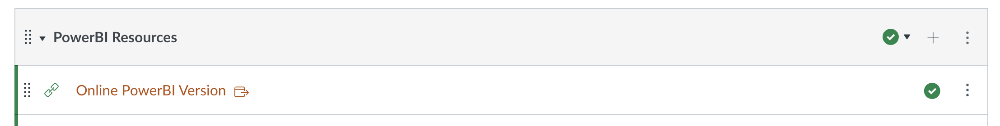
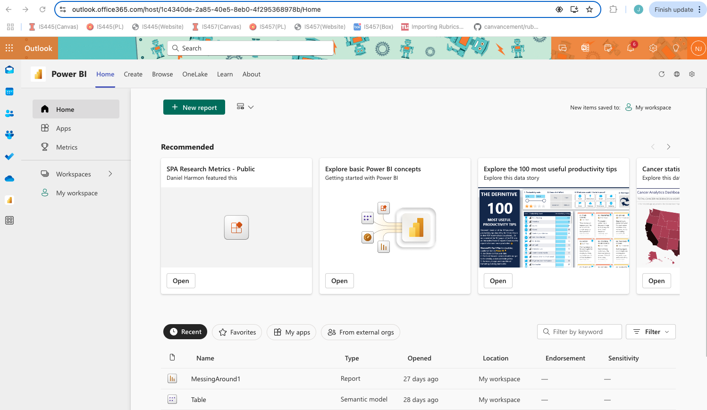

   
# Intro to PowerBI

---

## What is PowerBI?

notes:
first let's ask, what exactly is PowerBI? 

and then we can ask, how are we going to be using it in this class?

---

## What is PowerBI?

From the ["PowerBI Overview"](https://learn.microsoft.com/en-us/power-bi/fundamentals/power-bi-overview):

> Power BI consists of several elements that all work together, starting with these three basics:
> 
> * A Windows desktop application called Power BI Desktop.
> * An online software as a service (SaaS) service called the Power BI service.
> * Power BI Mobile apps for Windows, iOS, and Android devices.

notes:
here is a direct quote from one of the introductory overviews of powerbi

**read**

---

## What is PowerBI?

From the ["PowerBI Overview"](https://learn.microsoft.com/en-us/power-bi/fundamentals/power-bi-overview):

> Power BI consists of several elements that all work together, starting with these three basics:
> 
> * A Windows desktop application called Power BI Desktop.
> * An online software as a service (SaaS) service called the Power BI service.
> * Power BI Mobile apps for Windows, iOS, and Android devices.

notes:
Since not everybody has a windows machine, myself included, we'll be focused on the online-only version of PowerBI

you are welcome to use the desktop app if you want, just be aware instructions may be slightly different, and I won't be able to help you debug your visualizations as easily

---

## How to get setup on PowerBI

The online link is [https://app.fabric.microsoft.com/home?experience=power-bi](https://app.fabric.microsoft.com/home?experience=power-bi).

notes:
The link is available on the top of our Canvas Modules page, and linked here as well.

---

## How to get setup on PowerBI

Further instructions on our [first walkthrough](https://docs.google.com/document/d/1xfMojST2I-l7-UDvAouXrgoEV78QDFyvQ-I1d_ZzPVY/edit?usp=sharing).

notes:
further instructions are linked in our first walkthrough which we will start right after this lecture, but in brief...

---

## How to get setup on PowerBI

notes:
if you go to your "usual" outlook email, you can click on the little "app" icon and search for "Power" and it will typically show up

---

## How to get setup on PowerBI

notes:
for ease of access, you probably want to "pin" this to your side bar

---

## How to get setup on PowerBI

notes:
when it opens up, you should see an interface that looks something like the following

Unless you have worked here before, you probably won't have anything listed like my very informationally-named "MessingAround1" report shown at the bottom of this screen

---

## How to get setup on PowerBI

It is *strongly* suggested you use the Chrome Browser for this!

notes:
other browsers *may* work, but Firefox was a bit buggy for me
